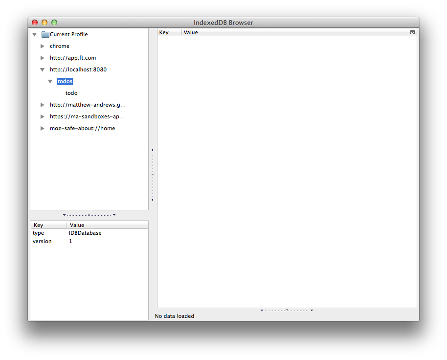

# Using dev tools

### Chrome

To check that the database has been succesfully created open the application in the browser, open up **Developer Tools** and click on the **Resources** tab.

### Firefox

- download [the IndexedDB browser](https://addons.mozilla.org/en-us/firefox/addon/indexeddb-browser/),
- find your profile folder, `cd ~/Library/Application\ Support/Firefox/Profiles/1yj54vgo.default/`.
- Create a symbolic link: `ln -s ./storage/persistent/ ./indexedDB`

### Safari

Safari is also a little different because it does not yet support IndexedDB in stable.  You can however still verify that the polyfill has correctly set the database up in WebSQL.

---

[← Back to *Opening a database*](../02-opening-a-database) | [Continue to *creating object stores* →](../04-creating-object-stores)
