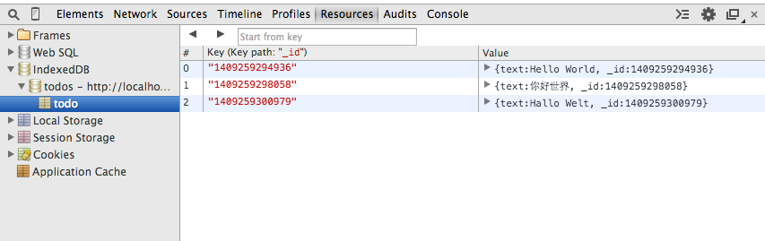

# Adding items

The next step is to enable the user to add items.

##### `/application.js`

Note that I’ve omitted the database’s opening code, indicated by ellipses (…) below:

```js
(function() {
  var db, input;

  databaseOpen()
    .then(function() {
      input = document.querySelector('input');
      document.body.addEventListener('submit', onSubmit);
    });

  function onSubmit(e) {
    e.preventDefault();
    var todo = { text: input.value, _id: String(Date.now()) };
    databaseTodosPut(todo)
      .then(function() {
        input.value = '';
      });
  }

[…]

  function databaseTodosPut(todo) {
    return new Promise(function(resolve, reject) {
      var transaction = db.transaction(['todo'], 'readwrite');
      var store = transaction.objectStore('todo');
      var request = store.put(todo);
      request.onsuccess = resolve;
      request.onerror = reject;
    });
  }

}());
```

We’ve added two bits of code here:

- The event listener responds to every `submit` event, prevents that event’s default action (which would otherwise refresh the page), calls `databaseTodosPut` with the value of the `input` element, and (if the item is successfully added) sets the value of the `input` element to be empty.
- A function named `databaseTodosPut` returns a promise, stores the to-do item in the local database, along with a timestamp, and then resolves the promise.

To test that this works, open up the web app again. Type some words into the `input` element and press **Enter**. Repeat this a few times, and then open up **Developer Tools** to the **Resources** tab again. You should see the items that you typed now appear in the todo object store.



After adding a few items, they should appear in the todo object store.

#### Exercises

- Find out what the difference is between `IDBObjectStore#add` and `IDBObjectStore#put` is.  What are the advantages of using `put` over `add`?


#### Solutions

- It's equivalent to the difference between the `POST` and `PUT` verbs in RESTful APIs, or `INSERT` versus `REPLACE` in SQL.  `add` will always create something fresh and if an attempt is made to create something with a key that already exists it will fail - whereas `put` will override the item with the existing key.  We use `put` here to simplify the implementation for demonstration purposes (we don't need to handle the error case).

---

[← Back to *Review: `window.indexedDB`*](../05-review-window-indexeddb) | [Continue to *updating data* →](../07-getting-data)
