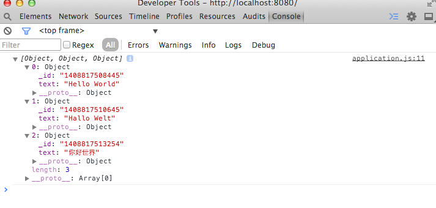

# Retrieving items

Now that we’ve stored some data, the next step is to work out how to retrieve it.

##### /application.js

Again, the ellipses indicate code that we have already implemented in the previous steps.

```js
(function() {
  var db, input;

  databaseOpen
    .then(function() {
      input = document.getElementsByTagName('input')[0];
      document.body.addEventListener('submit', onSubmit);
    })
    .then(databaseTodosGet)
    .then(function(todos) {
      console.log(todos);
    }); 

[…]

  function databaseTodosGet() {
    return new Promise(function(resolve, reject) {
      var transaction = db.transaction(['todo'], 'readwrite');
      var store = transaction.objectStore('todo');

      // Get everything in the store
      var keyRange = IDBKeyRange.lowerBound(0);
      var cursorRequest = store.openCursor(keyRange);

      // This fires once per row in the store, so for simplicity collect the data
      // in an array (data) and send it pass it in the resolve call in one go
      var data = [];
      cursorRequest.onsuccess = function(e) {
        var result = e.target.result;

        // If there's data, add it to array
        if (result) {
          data.push(result.value);
          result.continue();

        // Reach the end of the data
        } else {
          resolve(data);
        }
      };
    });
  }

}());
```

After the database has been initialized, this will retrieve all of the to-do items and output them to Dev Tools console.

Notice how the `onsuccess` callback is called after each item is retrieved from the object store. To keep things simple, we put each result into an array named `data`, and when we run out of results (which happens when we’ve retrieved all of the items), we resolve the promise with that array. This approach is simple, but other approaches might be more efficient.

If you reopen the application again, Dev Tools console should look a bit like this:



---

[Continue to *deleting data* →](../07-deleting-data)
