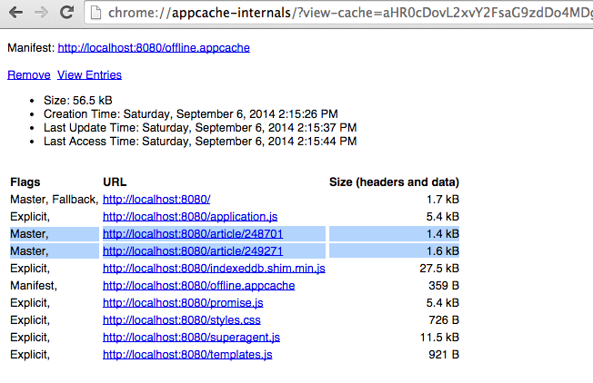

# Hacking AppCache

Try to implement AppCache using the same approach we tried for our previous prototypes.  Use `chrome://appcache-internal` to see which files have been saved.  What happens?

Use this snippet to serve an AppCache manifest from express:-

```js
app.get('/offline.appcache', function(req, res) {
  res.set('Content-Type', 'text/cache-manifest');
  res.send('CACHE MANIFEST'
    + '\n./application.js'
    + '\n./indexeddb.shim.min.js'
    + '\n./promise.js'
    + '\n./styles.css'
    + '\n./superagent.js'
    + '\n./templates.js'
    + '\n'
    + '\nFALLBACK:'
    + '\n/ /'
    + '\n'
    + '\nNETWORK:'
    + '\n*');
});
```

(We could do this by creating a static file, `/public/offline.appcache`, but you'll soon see why we've taken this approach)

## AppCache leaks



You will notice that each time you load a URL from the server that page gets _implicitly added_ to the AppCache.  This causes a number of problems:-

- Every time your user visits a new page on your website, it gets added to the AppCache, endlessly - until the device runs out of space.  Possibly fine for a small website, but for most websites (think Wikipedia or FT.com) this would be very, very bad.  Remember the browser will treat pages that have different query parameters separately.  `/article/11?something=true` is different to `/article/11?something=false` and **both** will get added to the application cache.  Forever.
- All resources added to the AppCache is then frozen until the next time the AppCache manifest is changed.  Your application probably doesn't change as often as your content.  At the FT, for example, we publish new content or updates to existing content every few minutes - but only ever update our application every few days.  Remember that every time we change the application cache manifest we must re-download every item in the application cache - even if only one file has changed.  This is going to use up our customer's data allowances and hit our servers hard.

This is really bad.  Luckily someone has come up with a workaround.

## Iframes to the rescue

Rather than referencing your AppCache manifest on every page on your site, you can instead include an iframe that points to a single page that the user never sees that connects to that iframe.
