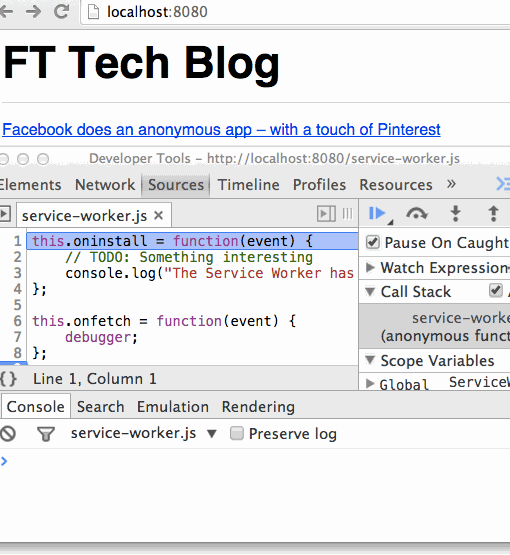
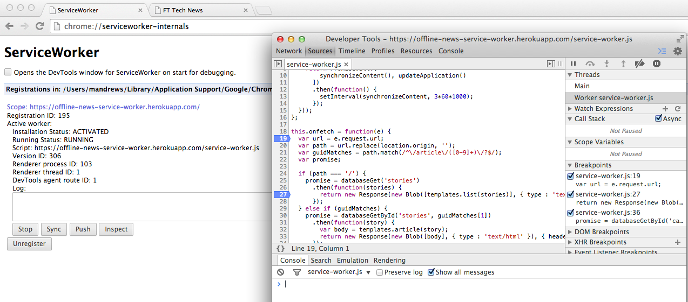

# Registering a Service Worker

## Enabling Service Workers

Service Workers are not enabled by default in web browsers right now.  In order to use them in Chrome you must first switch on a feature flag.  To do this go to:-

```
chrome://flags
```

... and search for **Enable experimental Web Platform features** and click **Enable**.


## Registering Service Workers

To get a Service Worker attached to our web page we need to use `navigator.serviceWorker.register`.  It's API is this:-

```js
Promise register(scriptURL, options);
```

All asynchronous APIs related to Service Workers, including `serviceWorker.register`, return [native browser Promises](https://developer.mozilla.org/en-US/docs/Web/JavaScript/Reference/Global_Objects/Promise) - in fact we can throw away our Promise polyfill because browsers must support Promises before supporting Service Workers.

Once you've called `serviceWorker.register` the browser will load the Service Worker at the URL specified by `scriptURL` and fire the `install` event on it.  You can listen to that event within the Service Worker like this:-

```js
this.oninstall = function(e) {
  e.waitUntil(/* a promise */);
};
```

Passing a Promise into the `waitUntil` method on the event object tells the browser to `waitUntil` that Promise resolves - and once that promise resolves the Promise returned from `serviceWorker.register` on the page that registered the Service Worker will resolve.

### Other Service Worker events

There are other events that you can listen to from within Service Worker, the most useful of which is `fetch`.  This event allows you to hook into and/or respond to requests for pages on your website.  You can even set breakpoints from within Dev Tools and respond to requests manually from the console.

```js
this.onfetch = function(e) {
  debugger;
  event.waitUntil(new Response("Hello world!"));
};
```



## Accessing Dev Tools for Service Worker

### Chrome



```
chrome://serviceworker-internals
```

Then click **Inspect**

### Firefox

Not yet :cry:.  https://jakearchibald.github.io/isserviceworkerready/#debugging

## Exercises

- Register a Service Worker that listens to the `install` event on our news application.
- Find out how to open Dev Tools in a Service Worker and experiment with setting breakpoints.

## Implementing Service Worker in the news app

##### [`public/application.js`](./public/application)

```js
(function() {
  if ('serviceWorker' in navigator) {
    navigator.serviceWorker.register('/service-worker.js');
  }
}());
```

##### [`public/service-worker.js`](./public/service-worker.js)

```js
console.log("I am a Service Worker");

this.oninstall = function(e) {
  // TODO: Something interesting
  console.log("The Service Worker has been installed");
};
```

---

[← Back to *Scaffolding*](../01-scaffolding) | [Continue to *Service Worker Cache* →](../03-service-worker-caches)
