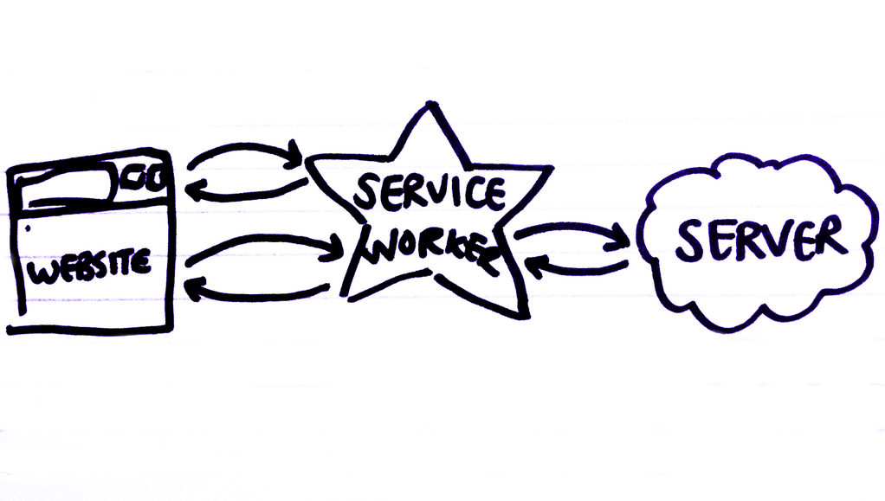

# Offline news with Service Worker

To get AppCache to work with our offline news website required us to write so many awful confusing hacks:-

- Varying the response of every page based on whether a cookie is set;
- Returning an HTTP error on the manifest when a cookie is not set;
- Created an iframe to load a page that loads the manifest rather than referencing it directly.
- Without the `NETWORK: *` hack in your AppCache manifest you will break all non-offline'd resources.
- If we deployed this as a real app on to a CDN we would also have to add hacks into the CDN too to vary its cache by cooke.

Luckily, a better way is coming.

## Service Workers

Service Workers are a new web browser feature that enable developers to write scripts that run independently from web pages, similar to shared workers, and are shared between web pages on the same domain name.

- They run **independently** from web pages, in the background
- They are **shared** between different URLs on the same domain.
- A domain can have **multiple** Service Workers.
- They can be **shut down** at the end of events.
- They are able to **intercept** and **manipulate** HTTP requests between the web application and the internet.
- They have their own mechanism to **cache requests** (in addition to the existing browser cache).
- They can enable websites to **work offline** because they are able to respond to requests and respond from a cache without an internet connection.
- They will probably [only be permitted on websites served over **https**](https://github.com/slightlyoff/ServiceWorker/issues/199).

Service Workers are meant to replace the HTML5 Application Cache. Unlike AppCache, which is controlled by [adding specific entries into a manifest file](https://developer.mozilla.org/en/docs/HTML/Using_the_application_cache), Service Workers are written in Javascript.

Or, in visual form:-

## Architecture

For our first Service Worker prototype we're going to take the simplest possible approach.

- The back-end will only contain routes for rendering the article list page and the article page.  Unlike the AppCache example, it won't be oblivious to the fact the app works offline.
- The front-end won't contain any JavaScript (except a line to install the Service Worker)
- Which leaves the Service Worker (the middle-end, if you like) to do the following things:-
  - Download and store the latest news.
  - Download and store the JavaScript and CSS files needed to run the application.
  - Respond to requests for either the application files or application pages and render them locally with local data - enabling the application to work offline.

---

[← Back to *success*](../05-offline-news/05-success) | [Continue to *scaffolding* →](01-scaffolding)
